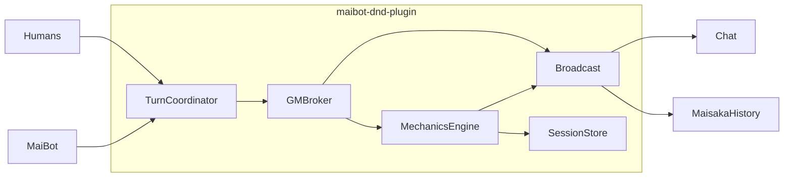

# maibot-dnd-plugin — Design Spec

**Date:** 2026-06-19  
**Status:** Approved (brainstorming)  
**Plugin id:** `maibot-dnd-plugin`  
**Architecture:** Approach 1 — Session engine monolith (single plugin, internal modules)

## Summary

A MaiBot first-party plugin that runs tabletop-style D&D sessions in group chat. The plugin owns session state, deterministic mechanics (dice, stats, items), and a dedicated GM LLM persona separate from MaiBot. MaiBot participates as an enrolled player via natural language (not tool-based play). Human players opt in via commands, complete mechanical character sheets, and interact through soft turns with full-message batching.

## Goals

- Run multi-player D&D-style sessions per chat stream with explicit opt-in
- Separate GM engine from MaiBot player persona
- Real ground truth for stats, dice, items, and effects; GM adjudicates mapping
- Setup via commands, tools, and natural group-chat discussion (MaiBot summarizes → tools)
- Review gate before play: campaign bible + GM prompt + per-player mechanical sheets
- Long sessions via scene-state + rolling summaries, not full chat history

## Non-goals (v1)

- Full automated D&D 5e rules engine (every spell/condition hard-coded)
- Split GM/player into two plugins
- MaiBot speaking as GM
- Relying on LLM-generated dice results
- Host or SDK source changes (optional SDK doc note for `sync_to_maisaka_history` only)

## Reference plugins

| Plugin | Patterns reused |
|---|---|
| `maibook-plugin` | Bible layout, readiness gate, `maisaka.context.append` + `proactive.trigger`, background tasks |
| `maibot-impression-card-plugin` | HTML → PNG character cards, per-user storage, mugshot images |
| `maibot-fetch-url-plugin` | Rulebook URL fetch + text ingest |
| `MaiBot-plastic-memory-plugin` | `@HookHandler` injection into replyer/planner |

---

## Architecture

### Runtime roles

1. **TurnCoordinator** — Message inbox, debounce, proceed triggers, initiative metadata, permissions
2. **MechanicsEngine** — Pure Python: dice, HP, items, conditions, roll log (no LLM)
3. **GMBroker** — Isolated `ctx.llm.generate` for GM beats; emits narration + structured intents
4. **Broadcast** — Chat output + Maisaka history sync; selective proactive wake for MaiBot
5. **SessionStore** — Filesystem persistence under `data/<stream_hash>/sessions/<session_id>/`



### Session states

```
CREATED → SETUP → READY → RUNNING ⇄ PAUSED → STOPPED
```

| State | Meaning |
|---|---|
| `SETUP` | Bible, GM prompt, character cards editable; players may join |
| `READY` | Review gate passed; awaiting `/dnd start` |
| `RUNNING` | Turn coordinator active; GM beats processing |
| `STOPPED` | Persisted; restart requires review gate again |

One **active** session per stream. Multiple **stopped** sessions retained with IDs for list/restart.

### Directory layout

```
maibot-dnd-plugin/
  plugin.py
  _manifest.json
  config.default.toml
  assets/
    character_card.html
    map.html
  data/<stream_hash>/
    sessions/<session_id>/
      session.toml
      gm-prompt.md
      bible/
        world.md
        plot-outline.md
        characters.md
        dictionary.json
        maps/
        rules/
      players/<person_id>.yaml
      state/
        turn.yaml
        scene-state.md
      journal/
        beats.jsonl
        rolls.jsonl
      summaries/
        scene-*.md
        episode-*.md
```

---

## Rules model: Adjudicated mechanics

### Division of responsibility

| Layer | Owner | Responsibility |
|---|---|---|
| Ground truth | Plugin | Character sheets, inventory, HP, spell slots, conditions, items, roll log |
| Mechanics engine | Plugin | Dice formulas, arithmetic, apply typed effects |
| GM adjudicator | GM LLM | Map situation → mechanic; honor/reject off-turn actions; spawn items when justified; reference rulebook |

### GM beat flow

1. TurnCoordinator flushes inbox (trigger: `/dnd proceed`, debounce, or admin skip)
2. Build GM context (see Context strategy)
3. GMBroker LLM returns: narration, mechanics intents, per-player feedback, turn advance, optional bible/map patches, spawn items
4. MechanicsEngine executes each intent deterministically
5. Broadcast narration + roll results + rejections
6. Persist beat to `journal/beats.jsonl`; update `scene-state.md` and `turn.yaml`
7. If MaiBot is new active player → wake (see MaiBot integration)

### Mechanics intent examples

```json
{
  "kind": "skill_check",
  "actor": "alice",
  "skill": "perception",
  "ability": "wis",
  "dc": 13,
  "disadvantage": true,
  "reason": "浓雾中搜寻足迹"
}
```

```json
{
  "kind": "use_item",
  "actor": "bob",
  "item_id": "potion_of_healing"
}
```

```json
{
  "kind": "spawn_item",
  "item": {
    "id": "rusty_key",
    "name": "生锈的钥匙",
    "effects": [{"kind": "narrative_tag", "tag": "opens_cell_3"}]
  },
  "give_to": "alice"
}
```

### Campaign mechanics profile

Configured in `session.toml` / plugin config template:

```toml
[mechanics]
base_system = "5e-lite"
ability_scores = ["str", "dex", "con", "int", "wis", "cha"]
```

Homebrew stats/skills extend the profile; engine uses generic stat + modifier + DC paths.

---

## Turn model: Soft turns + full inbox

### Principles

- Plugin tracks **active player** and initiative order (advisory for GM, not hard code gate)
- **All** enrolled player messages enter the inbox; GM honors or rejects off-turn actions
- Off-turn rejection delivered as direct feedback (`visibility: direct`) or public GM message

### Debounce rules

| Condition | Behavior |
|---|---|
| Active player has not spoken this beat | No timeout; inbox accumulates |
| Active player speaks | Set `active_has_spoken = true`; start/restart debounce timer |
| Active player speaks again before timeout | Reset debounce |
| Timeout fires | Auto GM beat |
| Active player never speaks | Wait indefinitely (`/dnd skip` for creator/admin) |

### Proceed authority

Any **enrolled player** may `/dnd proceed` or use `dnd_proceed` tool. MaiBot has tool parity but primarily plays via natural language in chat.

### Processing lock

While a GM beat runs, new messages queue for the next beat. `/dnd proceed` during processing returns a busy message.

---

## MaiBot integration

### Critical: plugin send ≠ Maisaka context

`ctx.send.text` does **not** enter MaiBot's pipeline by default. Host supports `sync_to_maisaka_history=True` (SDK passes `**kwargs` through).

### Broadcast helper pattern

| Message kind | Chat send | `sync_to_maisaka_history` | `proactive.trigger` |
|---|---|---|---|
| GM narration / dice / rejections | Yes `【地下城·GM】` | Yes | No |
| Turn prompt (human active) | Yes `【地下城】` | Yes | No |
| MaiBot active turn prompt | Same public text | Yes | Yes |
| Player actions | Normal chat / replyer | N/A (native pipeline) | No |

Fallback if sync fails: log warning + explicit `maisaka.context.append` (not silent).

### Player capture

| Source | Capture method |
|---|---|
| Human players | Message events → inbox |
| MaiBot | `@HookHandler("maisaka.replyer.after_response")` → inbox |
| GM/system output | Broadcast only; not inbox |

MaiBot's turn completes on **replyer output**, not on proactive trigger alone.

### Idle session injection

When session `RUNNING` and MaiBot enrolled: light `@HookHandler` inject on replyer with scene briefing + her character sheet. She reads the same GM feed as other players.

---

## GM voice

All GM output via system channel (Option A). Prefix: `【地下城·GM】`. MaiBot is never the GM voice.

Optional rendered images (maps, character cards) via `ctx.render.html2png` following impression-card pattern.

---

## Session administration

### Roles

| Role | Acquisition | Powers |
|---|---|---|
| Config admin | `admin_qq_ids` in config | Always create/stop/restart/handoff |
| Creator | `/dnd new` when no active session | Setup, start, restart **this** session, handoff |
| Enrolled player | `/dnd join` + complete character card | Play, proceed, stop **running** session |
| Others | — | Normal chat |

### Config

```toml
[permissions]
admin_qq_ids = []
open_mode = false   # true → fully open (anyone can admin lifecycle)
```

### Permission matrix

| Action | Admin | Creator | Enrolled | Others |
|---|---|---|---|---|
| `/dnd new` (no session) | Yes | Yes (becomes creator) | Yes | Yes |
| Setup / start | Yes | Yes | No* | No |
| `/dnd join` | Yes | Yes | Yes | Yes |
| `/dnd proceed` | If enrolled | If enrolled | Yes | No |
| `/dnd stop` (running) | Yes | Yes | Yes | No |
| `/dnd restart <id>` (stopped) | Yes | Yes (own sessions only) | No | No |
| `/dnd handoff @user` | Yes | Yes | No | No |

*Enrolled players edit their own character sheet only.

### Handoff

`/dnd handoff @bob` → bob becomes creator; previous creator loses admin (keeps enrollment if enrolled).

---

## Review gates

### Campaign gate (Option A — maibook-like)

Required before `/dnd start`:

| Artifact | Path |
|---|---|
| World setting | `bible/world.md` (non-empty) |
| Plot outline | `bible/plot-outline.md` (non-empty) |
| Characters overview | `bible/characters.md` (non-empty) |
| GM sub-prompt | `gm-prompt.md` (non-empty) OR config template marked complete |

Tool: `dnd_review_ready` / `/dnd review` — returns checklist; sets `READY` on pass.

Restart after stop **always** re-runs review (new players may have joined).

### Character gate (Option B — mechanical minimum)

Each **enrolled** player (including MaiBot) must have:

| Field | Required |
|---|---|
| Name | Yes |
| Ability scores | Yes (per campaign profile) |
| HP | Yes |
| ≥1 skill | Yes |
| Mugshot | No |
| Backstory | No |

Validation is programmatic. Mid-session joiners: story **held** until card complete.

---

## Commands & tools

### Commands (representative)

**Lifecycle:** `/dnd new`, `list`, `status`, `start`, `stop`, `restart <id>`, `handoff @user`  
**Play:** `/dnd join`, `leave`, `proceed`, `turn`, `skip`, `ooc`  
**Lookup:** `/dnd card`, `sheet`, `roll`, `dict`, `log`, `map`  
**Setup:** `/dnd bible`, `gm-prompt`, `review`, `import-rules`, `dict set`

### Tools

**Setup (creator/admin):** `dnd_setup_bible`, `dnd_setup_gm_prompt`, `dnd_setup_character`, `dnd_import_rulebook`, `dnd_dict_set`, `dnd_dict_query`, `dnd_review_ready`, `dnd_spawn_item`

**Play (enrolled):** `dnd_proceed`, `dnd_query_bible`, `dnd_query_log`, `dnd_roll`

In-session player actions are **natural language**, not tool calls. MaiBot uses tools for setup and explicit proceed; banter does not auto-write bible without tool/command.

### Rulebook import

URL → fetch text (httpx, same patterns as fetch-url plugin) → LLM splits into `bible/rules/<topic>.md`. Retrieval via `dnd_query_bible`; not full dump into GM context.

### Dictionary

`bible/dictionary.json`: term → explanation. Add via command/tool; GM context includes terms referenced in scene.

---

## Context & long-session strategy

### Log hierarchy

```
Campaign → Episode → Scene → Beat
```

- **Beat:** one GM flush cycle (`journal/beats.jsonl`)
- **Scene:** closes on GM `close_scene` or `/dnd scene close` → `summaries/scene-NNN.md`
- **Episode:** manual or GM-declared → `summaries/episode-NN.md`

### GM context budget (each beat)

Order (truncated by `gm_context_char_budget`, default ~120k):

1. GM system prompt (config + `gm-prompt.md`)
2. `state/scene-state.md`
3. Compact enrolled player sheets + active conditions
4. Bible excerpts (world + relevant plot; rules via retrieval)
5. Dictionary hits for pending messages
6. Last N beats (default 10)
7. Pending inbox with turn tags

**Excluded:** raw QQ history, non-enrolled messages, full rulebook.

### Scene-state as primary memory

GM emits `scene_state_patch` each beat; plugin merges into `scene-state.md`. This is the authoritative "what's true now" — not chat logs.

### Maps

- Source: `bible/maps/<name>.md` + `meta.yaml` (fog-of-war)
- LLM reads MD/YAML
- Players see rendered PNG via `map.html`
- Updates via structured map delta in GM beat

---

## Error handling

No silent fallbacks (不要兜底).

| Failure | Behavior |
|---|---|
| GM JSON parse fail | Retry once; else error, inbox preserved, no turn advance |
| Invalid mechanics intent | Reject intent, log, partial safe narration only |
| LLM timeout | Abort beat; prompt `/dnd proceed` retry |
| Review gate fail | Checklist returned; no state change |
| Permission denied | Explicit message |
| `sync_to_maisaka_history` fail | Log + fallback `context.append` |

---

## Configuration (defaults)

```toml
[plugin]
config_version = "0.1.0"

[permissions]
admin_qq_ids = []
open_mode = false

[session]
debounce_seconds = 45
gm_model = "planner"
gm_context_char_budget = 120000
recent_beats_limit = 10

[mechanics]
base_system = "5e-lite"

[broadcast]
system_prefix_gm = "【地下城·GM】"
system_prefix = "【地下城】"
sync_to_maisaka_history = true
```

Config versioning follows shared plugin pattern: `merge_plugin_config_data`, migration in `plugin.py`.

---

## Testing

| Layer | Type | Coverage |
|---|---|---|
| MechanicsEngine | Unit | Dice, modifiers, HP, items, conditions |
| TurnCoordinator | Unit | Debounce, inbox tags, permissions |
| Review gates | Unit | Campaign A + character B |
| GM JSON parser | Unit | Valid/invalid payloads |
| Plugin load | Smoke | `create_plugin()`, config migration, component registration |
| End-to-end | Manual | Symlink in MaiBot; full setup → one beat |

---

## Decision log

| Topic | Decision |
|---|---|
| Plugin name | `maibot-dnd-plugin` |
| Architecture | Session engine monolith (Approach 1) |
| Rules | Adjudicated mechanics |
| Turns | Soft + full inbox; GM honors/rejects |
| Batch trigger | Proceed or debounce after active speaks |
| Proceed authority | Any enrolled + MaiBot tool |
| MaiBot turn | Auto wake; debounce on replyer; NL play |
| GM voice | System channel + sync_to_maisaka_history |
| Session admin | Config admin + creator/enrolled; open_mode option |
| Character gate | B — name, abilities, HP, ≥1 skill |
| Campaign gate | A — world, plot-outline, characters, gm-prompt |
